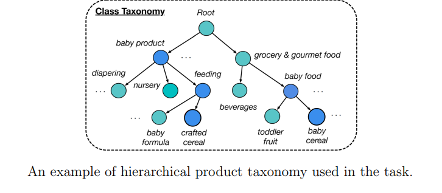

<style>
body, h1, h2, h3, p, table, pre, code {
    text-align: justify;
}
</style>

# Hierarchical Multi-Label Text Classification
2025/10/31 - 2025/12/20

## Overview

This project addresses a **Hierarchical Multi-Label Text Classification** task. The objective is to classify product reviews into multiple relevant categories, while **no ground-truth labels are provided**. Each document is associated with **two to three product categories**, which are organized in a **directed acyclic hierarchical taxonomy of 531 classes**.

We are given:
- 29,487 unlabeled text reviews
- 19,658 reviews for prediction
- A taxonomy file defining parent–child relationships between categories
- A list of keywords associated with each category

Since the existing labels are incomplete and noisy, we refine them into silver labels using the class-related keywords and the hierarchical structure of the taxonomy. These improved labels are then used to train a hierarchical multi-label classification model that can predict the relevant product categories for each review while respecting parent–child dependencies.

The project evaluates different learning strategies such as self-training, pseudo-labeling, and graph-based methods, and compares their impact on performance. Finally, examples of both correct and incorrect predictions are analyzed to better understand the model’s behavior (see Report/).

## Repository Structure

TODO

## Requirements

TODO

Python
PyTorch + Transformers
DGL
Pandas, NumPy, Scikit-Learn
GPU recommended

## How to run the project and reproduce the results

TODO

## Note : Reproducibility

To reproduct the same results, we use a seed : 

```py
import random, numpy as np, torch
random.seed(42)
np.random.seed(42)
torch.manual_seed(42)
torch.cuda.manual_seed_all(42)
```

## Submissions format

For each id in the test set, we predict a label for the target id(0~19657). The submission file contain a header and have the following format:

`id, label 0, 3,21 1, 10,220,242 2, 0,216 3, 23,26,89 etc.`

## Author
Name: Noam CATHERINE
Student ID: 2025952809
Course: DATA304 — Big Data Analysis

## Credits
This work was conducted as part of an academic assignment for the Big Data Analysis course at Korea University.  
It is provided for reference only and **should not be copied or reused** for other submissions.

## Useful Links
Task reference paper:  
https://aclanthology.org/2021.naacl-main.335.pdf

Taxonomy details:


## GitHUB
https://github.com/Mushahime/20252R0136DATA30400.git
